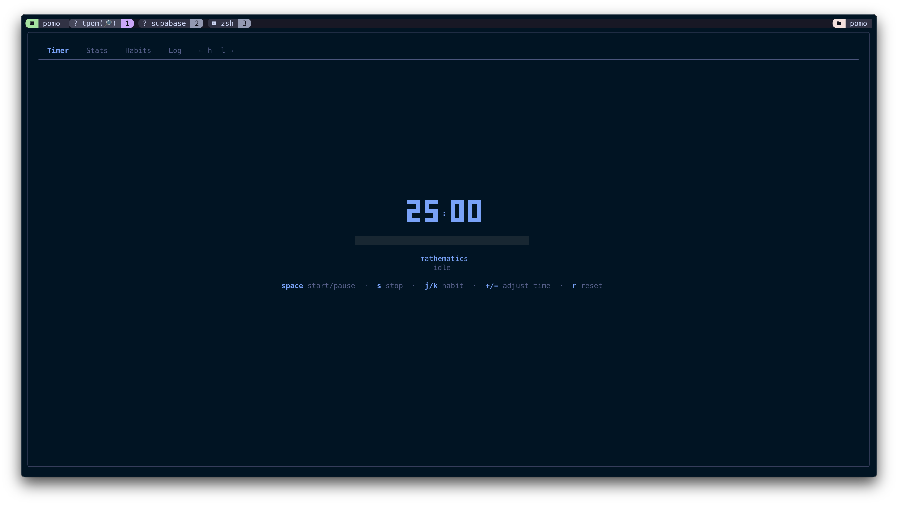
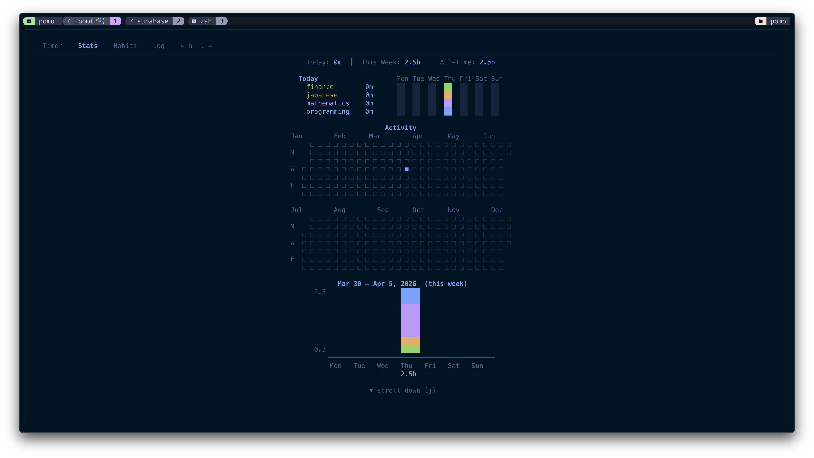

# tpom - Terminal Pomodoro

A minimalist pomodoro timer for the terminal, built with Go. Lazygit-style TUI with habit tracking, heatmaps, and statistics. Cloud sync via Supabase with an iOS companion app.

 

<p align="center">
  
</p>

<p align="center">
  
</p>

## Features

- **Timer** - Countdown with adjustable duration, pause/resume, overtime tracking
- **Todo** - Daily plain-text todo list that resets at the 4 AM day boundary; past days are kept and navigable read-only
- **Habits** - Track time across categories (programming, mathematics, finance, etc.)
- **Stats** - Year-long heatmap, weekly per-category bar chart, today/week/all-time totals
- **Log** - View, add, edit, and delete sessions with natural language input
- **Cloud Sync** - Supabase backend with real-time sync across devices
- **iOS App** - Companion app with WidgetKit widgets for home screen
- **Dark theme** - Tokyo Night inspired color palette

## Install

### Homebrew (recommended)

```bash
brew install MaximusBenjamin/tap/tpom
```

### From source

```bash
go install github.com/MaximusBenjamin/terminal-pomodoro@latest
```

### Clone and build

```bash
git clone https://github.com/MaximusBenjamin/terminal-pomodoro.git
cd terminal-pomodoro
go build -o tpom .
```

## Getting Started

```bash
tpom register    # Create a new account
tpom login       # Sign in (prompts for email and password)
tpom             # Launch the TUI
```

To sign out:

```bash
tpom logout
```

## Usage

### Navigation

| Key | Action |
|-----|--------|
| `h` / `l` | Switch tabs (left/right) |
| `q` | Quit |

### Timer

| Key | Action |
|-----|--------|
| `space` | Start / pause |
| `s` | Stop (prompts save/discard) |
| `r` | Reset (prompts save/discard) |
| `j` / `k` | Cycle habit |
| `+` / `-` | Adjust time by 5 min |

### Todo

| Key | Action |
|-----|--------|
| `j` / `k` | Navigate |
| `a` | Add todo |
| `space` | Toggle done |
| `e` | Edit todo |
| `d` | Delete todo (asks to confirm) |
| `←` / `→` | Previous / next day |
| `0` | Today |

Past days are read-only.

### Stats

| Key | Action |
|-----|--------|
| `j` / `k` | Scroll |
| `←` / `→` | Previous / next week |
| `0` | This week |

### Habits

| Key | Action |
|-----|--------|
| `j` / `k` | Navigate |
| `enter` | Select habit |
| `a` | Add habit |
| `d` | Delete habit |

### Log

| Key | Action |
|-----|--------|
| `j` / `k` | Navigate |
| `a` | Add session (natural language) |
| `e` | Edit session |
| `d` | Delete session |

## Adding Sessions Manually

The log tab accepts natural language input:

```
30m math
2h programming
1.5h finance
1pm to 2pm programming
1:30pm - 2:30pm math yesterday
from 9am to 11am programming monday
45 minutes finance 25 march
30m math 01/04/2026
```

Habit names support prefix matching: `math` -> `mathematics`, `prog` -> `programming`.

## Migrating from Local SQLite

If you previously used tpom with local-only storage, you can migrate your data:

```bash
tpom migrate
```

This uploads your local sessions and habits to the cloud. Safe to run multiple times (skips duplicates).

## Data

All data is synced via Supabase. Local auth credentials are stored at `~/.pomo/auth.json`.

## License

MIT
